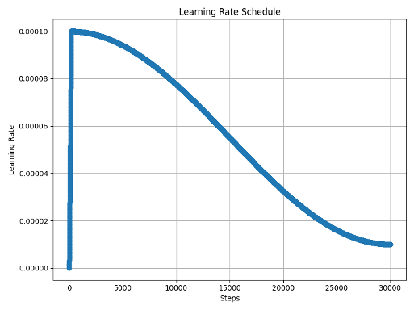
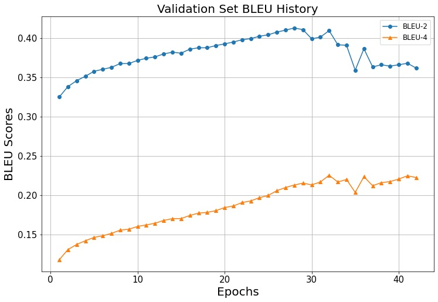
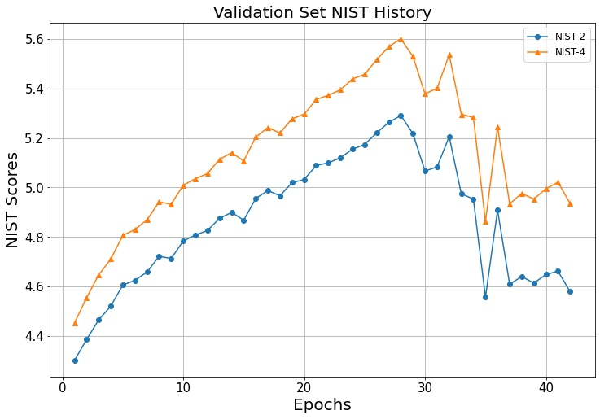
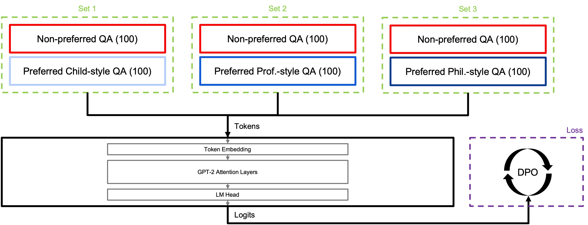
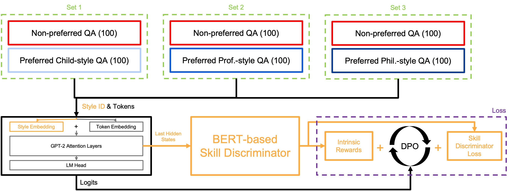

# Self-Personalizing Chatbot Tailored to User’s Style

## Purposes
Developing a chatbot model that can understand and adapt to a user’s conversational style involves leveraging reinforcement learning (RL) to improve the model's performance dynamically.
By incorporating RL algorithms, the chatbot can learn from user interactions to tailor its responses more effectively, enhancing the user experience.
This approach allows for an adaptable system capable of recognizing individual conversational nuances and refining its behavior over time.
This project was initiated to demonstrate the potential of a chatbot to evolve in real-time and adapt to individual user preferences.
Additionally, a demo page is provided to showcase how the chatbot adjusts to real user styles.

* Developing a chatbot model that can understand a person’s conversational style and adapt its responses accordingly.
* Improving the model’s performance by incorporating RL algorithms.
* Comparing the effects when applying RL to chatbot and creating a demo page tailord to real-world user scenarios.
<br><br><br>


## Methods
### 1. Pre-training a Language Model
For this project, I selected GPT-2 as the model and restricted the training data to everyday conversations.
To train the model with knowledge of daily conversations, I first performed pre-training using the [DailyDialog](http://yanran.li/dailydialog) dataset, which consists of multi-turn conversations.
The data statistics are shown in the table, and all data except for 2,000 validation and test samples were used for training. 
The model checkpoints were saved based on BLEU and NIST scores, and I evaluated using the validation set.
The training hyperparameters are detailed in the below.
* Model: Pretrained GPT-2
* Data: [DailyDialog](http://yanran.li/dailydialog) which is consists of everyday conversations and is structured as multi-turn exchanges.
    | Train      | Validation | Test       |
    |:----------:|:----------:|:----------:|
    |11,118      | 1,000      | 1,000      |
* Statistics
    | Total Dialogues | Avg. Turns per Dialogue | Avg. Tokens per Dialogue | Avg. Tokens per Utterance |
    |:---------------:|:-----------------------:|:------------------------:|:-------------------------:|
    | 13,118          | 7.9                     | 114.7                    | 14.6                      |

* Evaluation Metrics: BLEU-2, BLEU-4, NIST-2, NIST-4 
<br>I selected the model that achieved the best scores on the above metrics in the validation set.

* Hyperparameters
    | Steps | Batch size | LR0 | Warm up | User-turn Masking |
    |:-------:|:-----------------------:|:--------------:|:---------:|:---------:|
    | 30,000          | 60                     | 1e-4       | 200      | After 15,000 steps|
* Pre-training Results<br>
    * LR Curve<br>
    <br><br>
    * BLEU History<br>
    <br><br>
    * NIST History<br>
    <br><br>
    * Test Set Results<br>
    Test set results obtained from the model that achieved the highest evaluation metrics on the validation set.
    
        | BLEU-2 | BLEU-4 | NIST-2 | NIST-4 |
        |:------:|:------:|:------:|:------:|
        | 0.4052 | 0.2268 | 5.1797 | 5.5162 |

* Real-time Multi-turn Chatting Results<br>
    "Q" represents user (your inputs) message, and "A" represents the chatbot's response.
    ```
    Q: Have you ever been to France
    A: Oh, yes! I went there once last summer.
    Q: How was there?
    A: It was amazing.
    Q: Which spot was your best?
    A: That of the Louvre.

    Q: Did you see her yesterday?
    A: Yes, I did. I saw her with a pretty girl.
    Q: Oh where did you see her?                       
    A: She was in a cafe. She told me she was going to a concert.
    Q: I see. I've tried to contact her by phone, but she never received my call.
    A: I'm sure she was in New York. She said she'd be in New York at the latest.
    Q: Really? Thank you for your information. I will contact her today. Thanks.
    ```
<br><br>

### 2. Defining Styles and Collecting Training Data
I made 100 everyday life questions using GPT-4 API.
I defined three styles: child, professor, and philosopher.
I created preference data for each style to perforem RL alignment using the Direct Preference Optimization (DPO) algorithm.
Preferred response data for each style was created for 100 questions through GPT-4 API (Total 300 pairs of QA).
Also I should make non-preferred response data and its from the DailyDialog pre-trained GPT for 100 questions (Total 100 pairs of QA).<br>
* Preferred data: [Child Style](data/child_gt.csv), [Professor Style](data/professor_gt.csv), [Philosopher Style](data/philosopher_gt.csv)
* Non-preferred data: [Pre-trained GPT-2 Response](data/vanilla_gpt2_results.csv)
<br><br><br>

### 3. Fine-tuning the Model and Applying RL for Alignment
#### 3.1. Supervised Fine-tuning (SFT)
Before RL, Supervised Fine-tuning called SFT is typically performed.
For this, I trained the model using only 95% of the 300 preferred single-turn data with a small number of epochs.
Additionally, since style tokens representing each style were newly added to the model's vocabulary.
So performing SFT was necessary.
Below are examples of the tokens trained for each style during SFT.
```
Style 1 case: <BOS> {Question} <Style1> {Response} <EOS>
Style 2 case: <BOS> {Question} <Style2> {Response} <EOS>
Style 3 case: <BOS> {Question} <Style3> {Response} <EOS>
```

#### 3.2. RL Alignment
I applied two RL techniques to the SFT model.
The first was vanilla DPO, and the second is incorporating the skill concept introduced in [Diversity Is All You Need (DIAYN)](https://arxiv.org/abs/1802.06070) into DPO.
The token structure during the two RL processes was the same as that used in the earlier SFT training.

* Vanilla DPO<br>
Here, red boxes represents non-preferred QA and Blue-like boxes represents preferred style QA pairs.
To briefly explain DPO, it stands for Direct Preference Optimization.
Similar to RL, it starts by using a cloned reference model for training.
As training progresses, the model being trained learns to have higher logit probabilities for preferred answers compared to the reference model, and lower logit probabilities for non-preferred answers compared to the reference model. 
The DPO loss function is defined as follows:

    $$
    L_\text{DPO}(\pi_{\theta}; \pi_\text{ref}) = -E_{(x, y_w, y_l)\sim D}\left[\log \sigma \left(
    \beta \log \frac{\pi_{\theta}(y_w\mid x)}{\pi_\text{ref}(y_w\mid x)} \thinspace
    {- \beta \log \frac{\pi_{\theta}(y_l\mid x)}{\pi_\text{ref}(y_l\mid x)}}\right)\right]
    $$

    <br><br>

* DPO + DIAYN<br>
Yellow parts are different to the vanilla DPO case I explained right before.
First, when sampling the preferred and non-preferred answers for a question, I also simultaneously extract the integer value of the style ID.
Then, I add the result of the newly added style embedding layer in the model's token embedding.
Then, model’s last hidden state is fed into a BERT-based discriminator, which is trained to predict the style of the embedding.
Also, the intrinsic reward from the discriminator is added to the DPO loss, allowing them to be learned together.
The reason I used the last hidden state here is that, in the DIAYN model, the result containing the skill is passed to the discriminator.
If I pass the sentence tokens directly, backpropagation wouldn't be possible, so I used the last hidden state of the model, which contains the embedded skill information.
And the discriminator returns the probabilities for the three styles through softmax.
Based on these probabilities, I computed the intrinsic reward in the same way as described in the DIAYN paper.
The loss function is defined as follows:

    $$
    L_\text{DPO}(\pi_{\theta}; \pi_\text{ref}) = -E_{(x, y_w, y_l)\sim D}\left[\log \sigma \left(
    \beta \log \frac{\pi_{\theta}(y_w\mid x)}{\pi_\text{ref}(y_w\mid x)} \thinspace
    {- \beta \log \frac{\pi_{\theta}(y_l\mid x)}{\pi_\text{ref}(y_l\mid x)}}\right)\right]
    $$


    <br><br>


<br><br><br>

